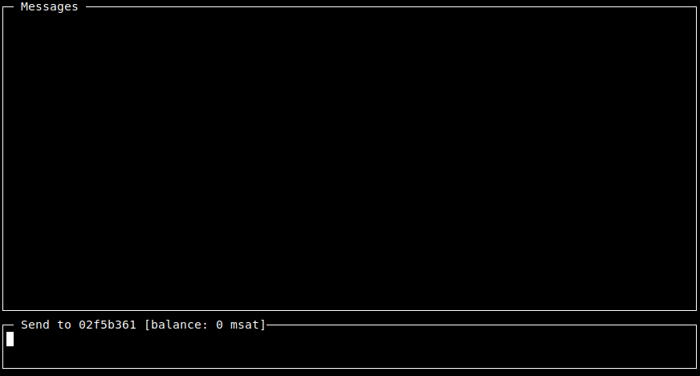

# Whatsat

## Introduction

Whatsat is a client application for [`lnd`](https://github.com/lightningnetwork/lnd) that demonstrates how the Lightning Network
can be used as an end-to-end encrypted, onion-routed, censorship-resistant, peer-to-peer chat messages protocol.

Recent [changes to the protocol](https://github.com/lightningnetwork/lightning-rfc/pull/619) made it easier then before to attach arbitrary data to a payment. This demo leverages that by attaching a text message and a sender signature.

Ideally users would send each other 0 sat payments and only drop off fees along the way. But that is currently not supported in the protocol. Also, there are minimum htlc amount constraints on channels. As a workaround, in anticipation of a true micropayment network, some money is paid to the recipient of the message. In this demo, it is 1000 msat by default (can be configured through a command line flag). Both parties keeping a running balance of what they owe the other and send that back with the next message.

A [previous version](https://github.com/joostjager/whatsat/tree/forked-lnd) of Whatsat used a more heavily customized fork of `lnd`. This fork also allowed sending messages for free by always failing payments. That approach has been abandoned because there is no good support in `lnd` to reliably intercept those failures at the receiver side.

## Usage

* Fetch `lnd` from the [key send](https://github.com/lightningnetwork/lnd/pull/3795) branch. (After this branch has been merged, Whatsat can run off of the master branch.)

* Build `lnd` with the router and signer sub-servers: `make tags="signrpc routerrpc"`.

* Run `lnd` with `--accept-key-send` to be able to accept chat messages.

* Set up the node as usual and open a channel to a well-connected node. Also make sure you have inbound liquidity too, otherwise it won't be possible to receive messages. And use public channels, otherwise people won't be able to find routes to deliver messages to you. No support for routing hints yet.

* Build whatsat: `go build`

* Run `whatsat chat <pubkey_or_alias>` to start chatting with your chosen destination.

  The blue checkmarks serve as delivery notifications. The amounts in blue on the right are the routing fees paid for the delivery. This
  does not include the amount paid to the recipient of the message, because it is assumed that that amount will be returned to us in the
  next reply.

  All chat messages end up in the same window. It is possible to switch to sending to a different destination by typing `/<pubkey_or_alias>` in the send box.

## Tuning LND for chat traffic

There are configuration parameters that can be changed to optimize `lnd` for chat traffic:

* `routerrpc.attemptcost=0`

  Prevents us from paying more for a reliable route. The default for this is 100 sats per attempt. For very low value (chat) payments, this means that we are going to overpay a lot on fees (relative to the payment amount) for a reliable route. Click [here](https://twitter.com/joostjgr/status/1186177262238031872) more information on this topic.

* If you want to forward chat traffic, make sure your forwarding policy minimum htlc amount is 1 msat and set your forwarding fee low for low amount. This can be configured through `lncli updatechanpolicy`. For example: `lncli updatechanpolicy 1 0 40 --min_htlc_msat 1 --max_htlc_msat 100000
` to charge a 1 msat fixed forwarding fee and only allow amounts between 1 msat and 100 sat.

## Finding peers that are good for chatting

For chat messages, the main peer selection criterium is the routing fee that you need to pay for the smallest possible payment amount. Run `whatsat chatpeers` to calculate that fee for all nodes on the ["bos list"](https://nodes.lightning.computer/availability/v1/btc.json). Nodes at the top of list are most interesting.

## Protocol

Whatsat messages are sent as custom records attached to the payment. The record identifiers that are currently in use are:

record identifier | content
--- | ---
5482373484 | key send preimage
34349334 | chat message
34349337 | signature(sender \| recipient \| timestamp \| msg) in Bitcoin ECDSA DER format.
34349339 | sender pubkey
34349343 | timestamp in nano seconds since unix epoch

## Disclaimer

This code only serves to demonstrate the concept and doesn't pass the required quality checks. Use with testnet sats only. If you really want to use it on mainnet, set up a dedicated node with a negligible amount of money on it and a few minimum sized channels.